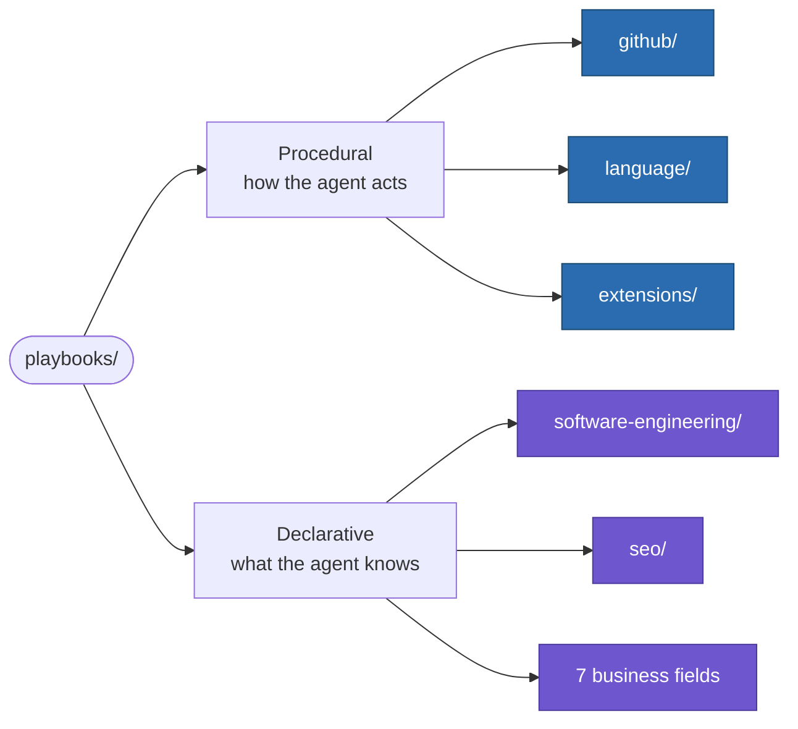

# Playbooks

Standing law and standing knowledge for an agent that reads before it acts, not after.

**[Why this exists](#why-this-exists) · [What's inside](#whats-inside) · [The note shape](#the-declarative-note-shape) · [Extensions](#extensions--the-newest-pillar) · [How to use this](#how-to-use-this) · [FAQ](#faq)**

---

## Why this exists

Every session without a playbook starts from zero: the same git discipline
re-derived from vibes, the same "is this markdown readable or agent-
navigable" tradeoff guessed at again, the same framework half-remembered
from a source skimmed once. 143 notes, researched once and consulted every
time since, close that gap — and the gap is worth naming precisely, not
just asserting:

| Instead of… | You get… |
|---|---|
| Re-deriving commit conventions from whatever feels right this session | `github/` — commit anatomy, a branching-model decision framework, and a preflight checklist that runs the same way every time, before every git or GitHub action |
| Writing markdown that's either pleasant for a human or navigable for an agent, never both | `language/markdown/` — 13 notes researched from Google's developer style guide, the Diátaxis framework, and the `markdownlint` rule set, on the premise that the two disciplines are actually one |
| Treating "Skill," "MCP server," and "plugin" as interchangeable jargon | `extensions/` — what each mechanism actually is, when each is the right one, which travel across agent harnesses by open design and which don't, with real external implementations studied in `*/maps/` |
| A framework applied from a half-remembered summary of a book or a PDF | 116 declarative notes — 110 business, 3 technical, 3 SEO — one fixed 7-part shape each, definition through watch-outs, every one grounded enough to say something real in front of a client |

## What's inside

Flat, two jobs, no wrapper folder around either — a playbook is already a
collection of fields, so nesting one more folder around that collection
would only repeat the word:

**Procedural — how the agent acts**, checked before doing the thing, not
facts about the world:

| Folder | Notes | Covers |
|---|---|---|
| `github/` | 5 | Commit anatomy, branching/concurrency, GitHub's platform-maturity ladder, and a discoverability checklist for anything made public — most of GitHub's ceremony is overhead below a certain project size, and a liability above it if skipped |
| `language/markdown/` | 13 | Syntax, voice, document types, frontmatter, GitHub-flavor and Obsidian-flavor rendering, README craft, the `llms.txt` spec, ADRs |
| `extensions/` | 9 (+1 map) | Skills, MCP servers, plugins — the mechanics, the open ecosystem, and when a plain note earns promotion into an auto-loading Skill |

**Declarative — what the agent knows**, independent of any instruction
about its own behavior:

| Folder | Notes | Covers |
|---|---|---|
| `software-engineering/` | 3 | Architecture principles, REST API design, AI agent architecture patterns |
| `seo/` | 3 | Technical/on-page/off-page fundamentals, Generative Engine Optimization (being cited by an LLM's answer), and GitHub/npm-specific discoverability — its own pillar because it spans client work and this operator's own publishing practice |
| `finance/` | 13 | Cash flow, burn/runway, valuation, cap tables, unit economics |
| `marketing/` | 22 | Positioning, growth loops, brand equity, attribution, market research |
| `strategy/` | 22 | Porter's Five Forces, Wardley Mapping, Blue Ocean — plus a live AI-strategy cluster: governance, maturity models, build-vs-buy |
| `operations/` | 18 | ISO/SOC 2/HIPAA compliance sitting next to Lean Six Sigma, TQM, theory of constraints — how the operation runs and how it proves it |
| `product-management/` | 22 | Discovery, prioritization, roadmapping, OKRs, delivery methodology |
| `people-org/` | 7 | Org design, team topologies, decision rights, team development |
| `sales-and-bizdev/` | 6 | Qualification frameworks, selling methodology, pipeline/revenue ops |

Read each folder's own README before its content — this file is the map,
not the content, and the same is true one level down.

## The declarative note shape

Every business and technical note — all 116 of them — follows one fixed
shape, documented canonically in
[software-engineering/README.md](software-engineering/README.md) so it's stated once, not
116 times:

<b>Definition → When to use → How it works → Example → Applying it for a client → Watch-outs → Related</b>

 

1. **Definition** — enough historical/practical context to know why it
   exists, not a dictionary line.
2. **When to use** — concrete trigger situations, not abstract conditions.
3. **How it works** — the actual mechanism, in full.
4. **Example** — one worked, concrete scenario.
5. **Applying it for a client** — something a consultant would actually
   say in a real engagement, not restated theory.
6. **Watch-outs** — specific failure modes and misconceptions.
7. **Related** — links to the notes that genuinely connect, one-line
   reason each.

The test for which side of the procedural/declarative split a note
belongs on: if it can't fill section 5 with something a consultant would
actually say to a client, it's either too abstract to be useful yet, or it
belongs in a procedural playbook instead.

## Extensions — the newest pillar

`extensions/` is standing law for what an agent installs to extend
itself — Skills, MCP servers, the plugin layer each harness bundles them
with — and it's the one part of this vault built to be true across more
than one agent harness on purpose, not by accident:

- A **Skill** follows the open Anthropic Agent Skills Spec. Claude Code
  and OpenCode both read it from the same global path, so one install
  reaches every harness that checks that path — no translation layer.
- An **MCP server** speaks the Model Context Protocol, an open standard
  with no single owning client. Any MCP-compatible harness can point at
  the same running server.
- A **plugin** is each harness's own bundling convention, and the one
  mechanism here that genuinely doesn't travel: Claude Code's plugin is a
  marketplace-distributed bundle, OpenCode's is TypeScript functions
  returning configuration. A collection built for one doesn't install
  into the other.

Real, external implementations get studied under `extensions/*/maps/` —
kept structurally separate from the law itself so a worked case study is
never mistaken for a universal rule, and the law stays clean enough to
apply to the next server or Skill this vault builds.

## How to use this

Before a non-trivial action anywhere — a git/GitHub operation, a markdown
edit, writing or installing a Skill, a domain call like a pricing model
or a GTM motion — check whether a note here already governs it, and defer
to that over instinct. [CLAUDE.md](CLAUDE.md) states this as the operating rule for
Claude Code; [AGENTS.md](AGENTS.md) is the same file, symlinked, so OpenCode reads
the identical rule without a second copy to keep in sync.

Nothing here outranks a project's own explicit convention — a stated
[CLAUDE.md](CLAUDE.md) rule, a client's style guide, a direct one-off instruction
from whoever owns that repo. This is the fallback for when nothing more
specific has been said, not a ceiling on it. Where no note exists yet,
judgment stands in — and if that judgment turns out durable enough to be
worth having on hand next time, it's a candidate to become the next note,
in the shape its siblings already use.

## FAQ

<b>Why isn't this just written into CLAUDE.md directly?</b>

 
Token budget and scope. CLAUDE.md is loaded every session whether or not
any of it is relevant to the task at hand; a 143-note vault loaded in full
every time would be almost entirely wasted context. Splitting it into
folders with their own README indexes means only the relevant slice loads
— the same cover/chapter/appendix discipline <a href="language/markdown/for-agents.md"><code>language/markdown/for-agents.md</code></a>
argues for applied to the vault's own shape, not just to individual files.

<b>Is this actually kept up to date, or does it rot like every other internal wiki?</b>

 
The structural half is checked mechanically, not trusted on faith: every
cross-reference in this vault is a real relative link, verified to resolve
to a file that actually exists and is tracked — not backtick-styled text
that only looks like it points somewhere. The content half — whether a
note's claims are still true — doesn't have that same automatic check yet;
<a href="extensions/MCP/authoring-a-server.md"><code>extensions/MCP/authoring-a-server.md</code></a>'s re-verifiable-claims principle is the
standing answer for where that's worth adding next, applied first to the
notes most exposed to drift.

<b>What stops this from becoming 143 shallow summaries?</b>

 
The note shape itself, specifically section 5. A note that can't say
something a consultant would actually tell a client — not restated
theory — either isn't ready to exist yet or belongs in a procedural
playbook instead. That's a real filter, checked per note, not a slogan.

<b>Why do git/markdown conventions sit next to brand equity and OKRs in the same vault?</b>

 
Different jobs, same underlying need: standing knowledge that's expensive
to re-derive and cheap to have written down once. The split in
<a href="#whats-inside">What's inside</a> — procedural vs. declarative —
is the actual organizing principle; the vault being useful for both a git
commit and a client strategy conversation is the point, not a scope
mismatch.

## The one rule that overrides all of this

A project's own stated convention always wins over these defaults. These
are what to do absent other instruction, not a mandate that overrides a
repo's [CLAUDE.md](CLAUDE.md), a client's style guide, or an explicit one-off
request.

---

[Changelog](CHANGELOG.md) · [MIT License](LICENSE) — the value here is
the synthesis and the agent-native structure, not exclusive ownership of
frameworks like SWOT or OKRs that were never proprietary to begin with.
